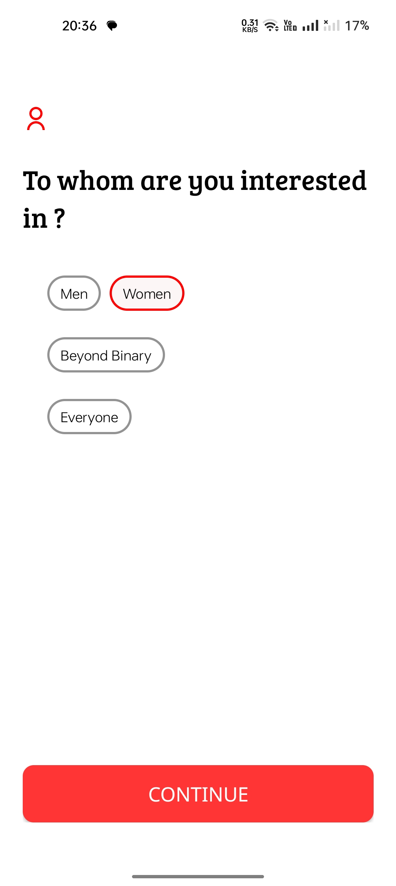
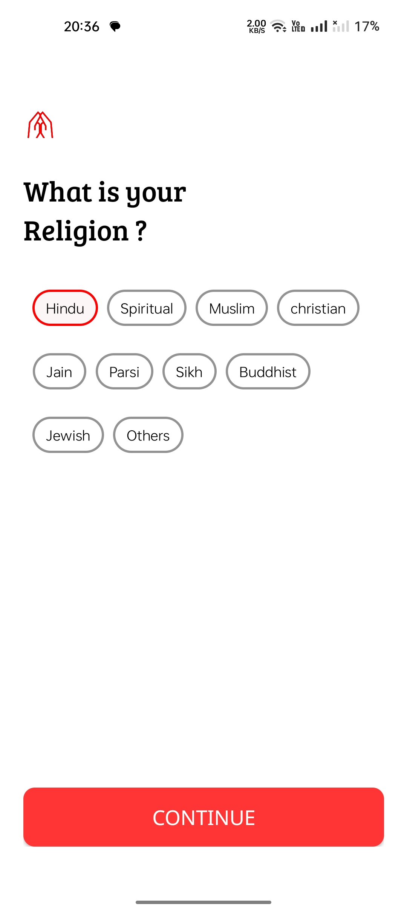

# Milap-Public-Repo
Public showcase of Milap, a dating app built with Android Studio using Java, Firebase Realtime Database, and FCM. Features include user onboarding, profile setup, swipe cards, mutual likes, notifications, and chat.

## 🚀 Features
- **Phone Number Authentication** – Secure login via OTP verification to ensure authenticity.  

- **Personalized Profiles** – Users create detailed profiles with personal information, preferences, and multiple photos.  

- **CardStack Swipe Interface** – Swipe right to like, left to pass, with smooth animations powered by CardStackView and Lottie. 

- **Smart Profile Display** – Each card highlights a profile photo, age, bio, and randomly selected hobbies for freshness.  

- **Photo Upload & Cropping** – Upload and crop up to 4 images during onboarding.

- **Real-Time Database Integration** – Powered by Firebase Realtime Database for instant syncing of user profiles, likes, and matches.  

- **Like & Match System** – Swipe right to like, and when two users like each other, they form a match.  

- **Notifications & Messaging** – Users get notified when someone likes them, with a built-in chat system for matched users.  

- **Dynamic User Discovery** – Fetches all user profiles at startup, displaying them in a stack for quick browsing.

## ⚙️ Tech Stack

- **Frontend (Android)** – Java, XML, Lottie Animations   

- **Backend** – Firebase Realtime Database & Firebase Authentication  
 
- **Media Handling** – Glide for image loading, built-in cropping tools for photo uploads  

- **Cloud Functions** – Used for match-making automation (triggered when two users like each other)  

## 🚀 Future Scope
- AI-powered match recommendations based on user preferences & hobbies  

- Advanced filters (location, interests, lifestyle choices)  

- Push notifications for messages and new matches  

- Profile verification badges  

# 📱 Screenshots

### User Login

User can access there account by Log in with their phone. If the user did not login previously then he need to complete the login setup so in future he don't need to set up again

| PhoneNo. Login | Otp Verification |
|------------|---------------|
|  |  |

### User Login

User has to fill the required things to complete the account seetup  

- Taking User About and Age confirmation

| PhoneNo. Login | Otp Verification |
|-------------|----------------|
|  |  |

- Taking User Gender and Gender Type

| Gender | Gender Type |
|-------------|----------------|
|  |  |

- Creation of user id and taking interested partner

| User id | Interested partner |
|-------------|----------------|
|  |  |

- Life Status and Hobbies

| Life Status | Hobbies |
|-------------|----------------|
|  |  |

- Life Partner and Set distance

| Life Partner | Set distance |
|-------------|----------------|
|  |  |

- Relegion and User bio

| Relegion | User bio |
|-------------|----------------|
|  |  |

- Relegion and User bio

| Relegion | User bio |
|-------------|----------------|
|  |  |

- Location Fetcher and Select photos

| Location Fetcher | Select photos |
|-------------|----------------|
|  |  |

- Edit Photo and Snaps

| Edit Photo | snaps |
|-------------|----------------|
|  |  |

- User will see the Welcome Page only first time after setting up profile and the logo will be shown everytime user open the app

| Welcome |
|-------------|
|  |

